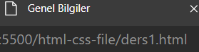
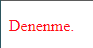
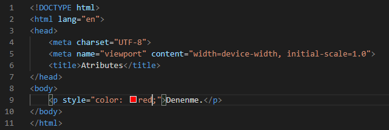
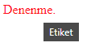
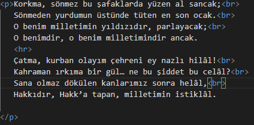
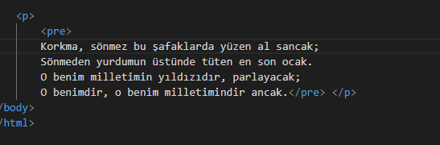
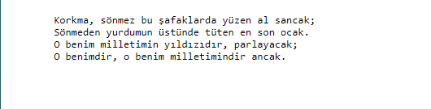

# Ders 1 
* Ana vücudu oluşturmak için "html:5" kullanılır.
* `<title>` Genel Bilgiler `</title>` elementlerinin arasına yazı yazarak sekme kısmında görünmesini sağlayabiliriz. 

* Paragraf oluşturmak için `

` tagı kullanılır.

# Ders 2
* `

` bu bir paragraf elementidir. Başlangıç ve bitiş elementi olup sondaki elementte / karakteri bulunur.

* Boşluk bırakmak için ` ` elementi kullanılır. Bu gibi elementlere boş element denir. Bitiş elementi bulunmaktadır.

* Bold yazı yazmak için elementin içine `<strong></strong>` yazılır.

# Ders 3
* Atribute'lar başlangıç elementinin içine yazılır.

* `style=""` kullanarak tagımızın birçok özelliğini değiştirebiliriz. Bu özellikler:
  
   

* title="Etiket" yaparak cursor yazının üzerine geldiğinde etiket göstermesini sağlayabiliriz.

  
  
  
* `<hmtl lang="tr">` bu şekilde yaparak Türkçe aramaların sonuçlarında görünürüz.

# Ders 4
* `<h1>` den `<h6>` 'ya kadar başlık elemendini kullanabiliriz. 

* `
` tagını kullanarak yazıyı çizgi ile bölebiliriz. Bu çizgi kıtaları vs. ayırmaya yarayabilir. 

* ` ` tagını kullanmak yerine `<pre>` tagını kullanarak yazıyı olduğu gibi yansıtabilirsiniz. Bu tagı kullandığımız zaman yazı fontumuz değişecektir.

W

# Ders 5

* Yazıyı olduğu fonttan birkaç pixel küçük göstermek için `<small></small>` tagı kullanılır

* Highlight vermek için (mark) `<mark>\</mark>` tagı kullanılır. 

* Yazının üzerini çizmek `<del>\</del>` tagı kullanılır.

* Yazının altını çizmek için `<ins>\</ins>` tagı kullanılır.

* Yazının üstüne küçük bir şekilde yerleştirmek için `` tagı kullanılır. 

* Yazıya bold efekti vermek için `<strong></strong>` tagı kullanılır. 

* Yazıyı italic yazmak için `<i></i>` tagı kullanılır.

* Yazıya italic vermek için başka bir yöntem olarak `<em></em>` tagı kullanılır. 

# Ders 6 
* Yazarın sözleri gibi sözleri yazarken `<q></q>` tagını kullanabiliriz.

* Mail adresi gibi adresleri yazacağımız zaman `<adress></adress>` tagını kullanabiliriz.

* Şehir gibi isimleri yazarken `<city></city>` tagı kullanabiliriz.

* Yazıyı tersten yazdırmak için `<bdo dir="rtl"></bdo>` tagını kullanabiliriz.

# Ders 7

* Yorum satırı yazmak için `<!-- yorum -->` kullanılır. 

* HEX kodları ile renk verebilirsiniz. `#ff6347` 

* RGB kodları ile renk verebilirsiniz. `rgb(255, 99, 71)`

* RGB kodlarının sonuna bir bölüm daha ekleyerek opacityyi ayarlayabilirsiniz. `rgba(255, 99, 71, 0.5)`

# Ders 8

* Html dosyasına Css bağlantısı yapmak için `<link></link>` elementi kulllanılır. Örnek: `<link rel="stylesheet" href="css-file/main.css">`

# Ders 9

* `<a href="https://www.omerayyildiz.com">Ömer Ayyıldız</a>` yazarak yazının üstüne tıklandığında belirttiğimiz siteye yönlendirebiliriz. 

* `<a href="https://www.omerayyildiz.com" target="_self">Ömer Ayyıldız</a>` yaptığımızda aynı sekme içerisinde açar. `<a href="https://www.omerayyildiz.com" target="_blank">Ömer Ayyıldız</a>` yaptığımızda ise farklı bir sekmede açar.

* `<a href="https://www.omerayyildiz.com">Ömer Ayyıldız</a>` bu bir absolute değer. `<a href="ders8.html">Ömer Ayyıldız</a>` ise raletive bir değer. Absolute farklı bir domaine yönlendirir. Relative ise aynı klasör içindeki farklı bir dosyaya yönlendirmek için kullanılıyor. 

* `` Bu şekilde resimlerede link atayabiliriz. Absolute veya relative olabilir. `alt=""` ise resimin kaynağını bulamadığı zaman göstereceği yazıdır. 

* `<a href="mailto:nikoplotis@gmail.com">İletişim</a>` kullanarak belirttiğimiz mail adresine mail gönderilmesini sağlayabiliriz. 

* Title elementini link kavramlarındada kullanabiliriz. 

