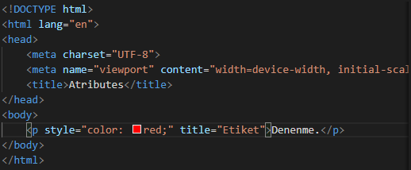
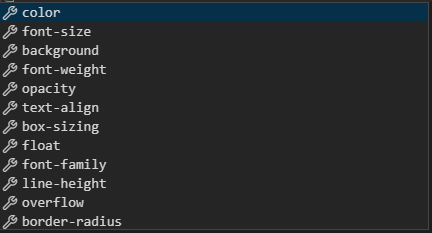
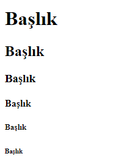
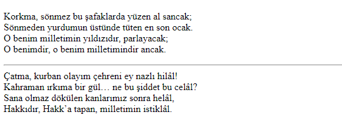

# Ders 1 
* Ana vücudu oluşturmak için "!" kullanılır.
* Paragraf oluşturmak için \
\
 tagı kullanılır.
* Boşluk bırakmak için \  tagı kullanılır.
* Bold yazı yazmak için elementin içine \<strong>\</strong> yazılır.
# Ders 2
* Atribute ilk tagın içine yazılır. 
* title="Paragraf" yaparak cursor yazının üzerine geldiğinde etiket göstermesini sağlayabilirsiniz. 

  

* style="" kullanarak tagımızın birçok özelliğini değiştirebiliriz. Bu özellikler:
  
   

# Ders 3
* \<h1> den \<h6>'ya kadar başlık elemendini kullanabiliriz. 

* \
 tagını kullanarak yazıyı bölebiliriz. Bu çizgi kıtaları vs. ayırmaya yarayabilir. 

* \  tagını kullanmak yerine \<pre> tagını kullanarak yazıyı olduğu gibi yansıtabilirsiniz.